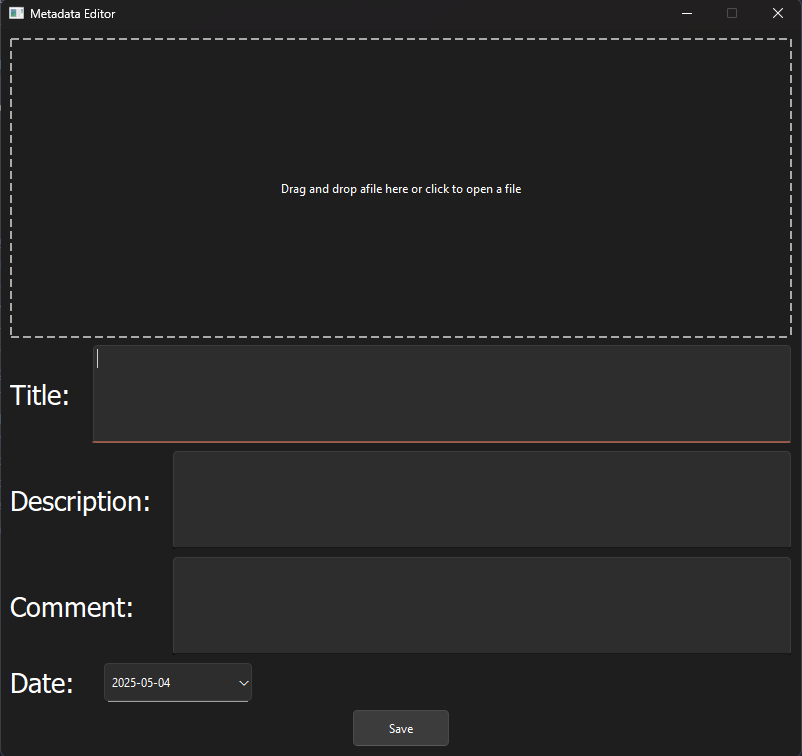
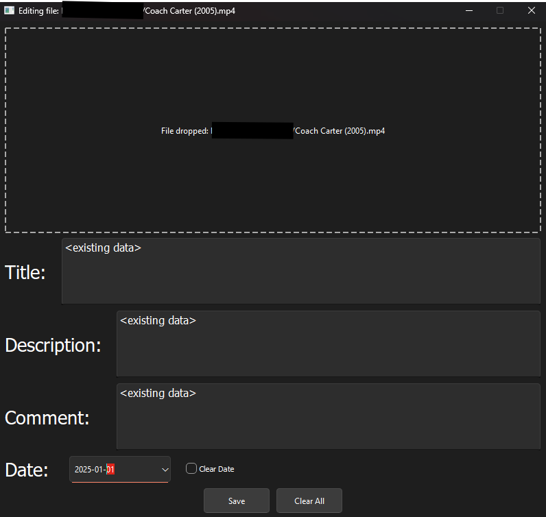
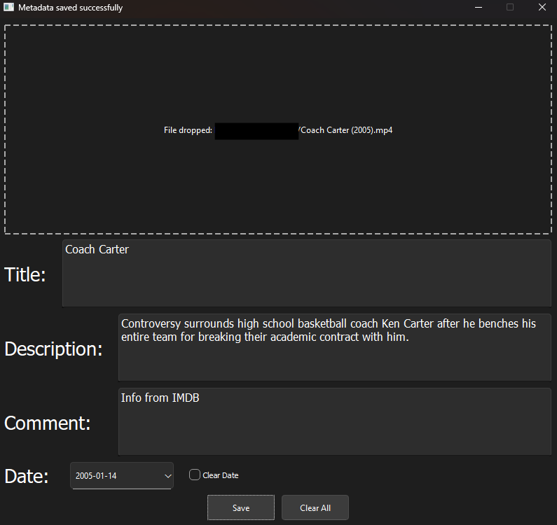

## Video Data Editor
`data-editor` is a PyQt6-based app for editing the metadata of video files. It allows users to drag and drop a file or select one via a file dialog, view it's metadata, and update certain types of metadata, like title,
description, and date released. This is done using the mutagen.MP4 library.

### Features
- **Drag-and-Drop Support**: Drag-and-drop a file into the app to load its metadata
- **File Dialog**: Alternatively, select a file using a file dialog
- **Metadata Editing**:
  - Edit the title (`\xa9nam` tag)
  - Edit the description (`desc` tag)
  - Edit the comment (`\xa9cmt` tag)
  - Edit the date (`\xa9day` tag)
- **Save Changes**: Save changes made to the metadata back to the original file
- **Simple User Interface**: Very simple user interface to navigate 

### Usage
1. Download `data-editor.py`
2. Download the required dependencies
```pip install mutagen pyqt6 ```
3. Navigate to the location of the script and run it. It should look like the picture below:
```python metadata-editor.py```



4. Click and select or drag a video file into the box. Any previously existing metadata will be loaded.



5. Make the desired changes and press the save button to confirm the changes.

